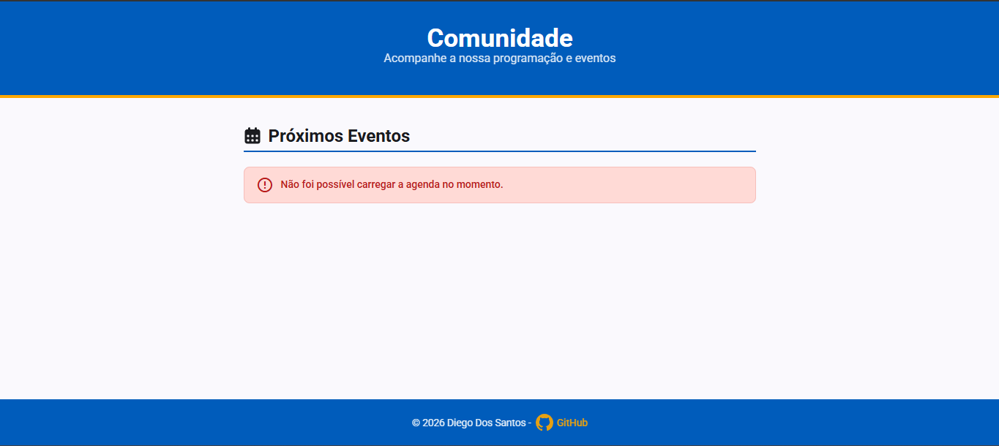

# 📅 Minha Agenda

Plataforma pessoal moderna e modular de gestão de compromissos e agenda, desenvolvida com **Angular (Standalone Components)** no frontend e um backend serverless leve em **Node.js/TypeScript**, integrada de forma segura com a **Google Calendar API** via OAuth2.

🌐 [Minha Agenda](http://localhost:3000/)



Desenvolvido por **Diego Dos Santos**.

---

## 🛠️ Stack Tecnológica

### Frontend

* **Angular (Standalone Components)** com reatividade moderna baseada em **Signals** e **RxJS** (`timer`, `switchMap`).
* **SCSS** com design system limpo, responsivo e adaptado ao ecossistema Material 3.

### Backend / API (Serverless)

* **Vercel Serverless Functions** (`api/calendar.ts`) em Node.js & TypeScript.
* Biblioteca oficial `googleapis` para comunicação segura com o Google Calendar.

### Infraestrutura & Ferramentas

* **Vercel CLI** para simulação local integrada (`vercel dev`) e gestão de ambientes.
* **Git / GitHub** para versionamento.

---

## 🏗️ Arquitetura e Decisões Técnicas

### 1. Polling Inteligente

Sem a complexidade e o custo de servidores WebSocket persistentes, o projeto utiliza um polling otimizado no Angular (`timer` + `switchMap`) que sincroniza os eventos do calendário automaticamente em segundo plano.

### 2. Segurança de Credenciais

As chaves sensíveis da API do Google:

* `GOOGLE_CLIENT_ID`
* `GOOGLE_CLIENT_SECRET`
* `GOOGLE_REFRESH_TOKEN`
* `GOOGLE_CALENDAR_ID`

**nunca** são expostas no código do frontend.

Elas residem exclusivamente no servidor e são geridas pelas **Variáveis de Ambiente da Vercel**.

### 3. Autenticação OAuth2 Automatizada

O repositório conta com um script dedicado (`scripts/gerar-token.ts`) para gerar com segurança o token de acesso de longa duração (`refreshToken`) junto ao Google Cloud.

---

## 📂 Estrutura de Pastas e Ficheiros-Chave

```text
├── api/
│   └── calendar.ts           # Função serverless da Vercel
│                              # (Backend que consome o Google Calendar)
│
├── scripts/
│   └── gerar-token.ts        # Script auxiliar para gerar o Refresh Token OAuth2
│
├── src/
│   ├── app/
│   │   ├── components/       # Componentes Standalone (Agenda, etc.)
│   │   ├── services/         # calendar.service.ts
│   │   │                      # (Gestão de polling e requisições)
│   │   └── ...
│   │
│   └── styles.scss           # Configuração de estilos globais e tokens M3
│
├── package.json
└── vercel.json
```

---

## ⚙️ Pré-requisitos

Certifique-se de ter instalado no seu ambiente de desenvolvimento:

* **Node.js** — versão LTS recomendada
* **npm**
* **Vercel CLI**

Para instalar a Vercel CLI globalmente:

```bash
npm install -g vercel
```

---

## 🚀 Configuração Inicial e Credenciais do Google

### 1. Configuração no Google Cloud Console

1. Aceda ao **Google Cloud Console**.
2. Crie um novo projeto.
3. Ative a **Google Calendar API**.
4. Configure o **Ecrã de consentimento OAuth (OAuth consent screen)**.
5. Crie credenciais do tipo **OAuth Client ID** (aplicação desktop ou web).
6. Guarde os seguintes valores:

   * `GOOGLE_CLIENT_ID`
   * `GOOGLE_CLIENT_SECRET`

### 2. Gerar o Refresh Token de Acesso

Crie um ficheiro `.env` na raiz do projeto com as credenciais temporárias do cliente.
Use como base `.env.example`

Em seguida, execute o script automatizado de autenticação:

```bash
npm run auth:generate
```

Siga as instruções apresentadas no terminal para autorizar a aplicação na sua conta Google.

O script gerará o `GOOGLE_REFRESH_TOKEN` necessário para o backend.

---

## 💻 Como Rodar o Projeto Localmente

O projeto possui um ambiente integrado que simula as funções serverless da Vercel juntamente com o servidor de desenvolvimento do Angular na mesma porta (`3000`).

### 1. Descarregar as variáveis de ambiente

Caso as variáveis já estejam configuradas na Vercel, execute:

```bash
npm run env:pull:dev
```

### 2. Iniciar o ambiente integrado

Para iniciar o frontend juntamente com o backend serverless:

```bash
npm run vercel:dev
```

Depois, aceda a:

**http://localhost:3000**

> Alternativamente, para executar apenas o frontend de forma isolada, sem o backend serverless ativo, utilize `npm start`.

---

## 📋 Mapeamento Completo de Scripts

| Comando                    | Descrição                                                                                            |
| -------------------------- | ---------------------------------------------------------------------------------------------------- |
| `npm start`                | Inicia o servidor de desenvolvimento do Angular de forma isolada, com proxy se configurado.          |
| `npm run build`            | Compila a aplicação para produção, otimizando os artefatos na pasta `dist/`.                         |
| `npm run watch`            | Compila o código em modo de escuta contínua para desenvolvimento.                                    |
| `npm test`                 | Executa os testes unitários da aplicação (`specs`).                                                  |
| `npm run vercel:dev`       | Ambiente integrado: executa o simulador local da Vercel (Frontend + API Serverless) na porta `3000`. |
| `npm run auth:generate`    | Executa o script de geração do token OAuth do Google Calendar.                                       |
| `npm run env:pull:dev`     | Descarrega as variáveis de ambiente de desenvolvimento da Vercel para o ficheiro `.env` local.       |
| `npm run env:pull:preview` | Descarrega as variáveis do ambiente de preview/staging.                                              |
| `npm run env:pull:prod`    | Descarrega as variáveis do ambiente de produção.                                                     |
| `npm run env:push`         | Adiciona ou atualiza uma variável de ambiente diretamente no painel da Vercel (`vercel env add`).    |

---

## 🚢 Guia de Deploy e Produção

O deploy é gerido nativamente pela infraestrutura da Vercel.

### Deploy de Preview (Staging / Pull Requests)

```bash
vercel
```

### Deploy Definitivo em Produção

```bash
vercel --prod
```

### 🔐 Variáveis de Ambiente

Antes de efetuar o deploy de produção, certifique-se de que todas as variáveis de ambiente estão devidamente cadastradas no painel de configurações da Vercel:

```text
GOOGLE_CLIENT_ID
GOOGLE_CLIENT_SECRET
GOOGLE_REFRESH_TOKEN
GOOGLE_CALENDAR_ID
```

> ⚠️ **Importante:** nunca versione o ficheiro `.env` ou exponha credenciais do Google no código-fonte ou no frontend.
