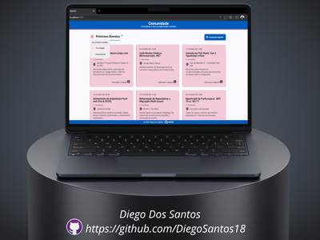
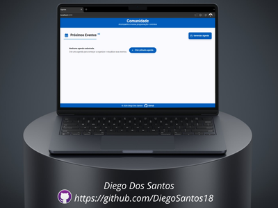
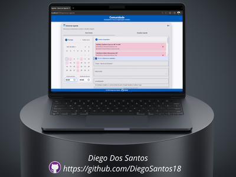
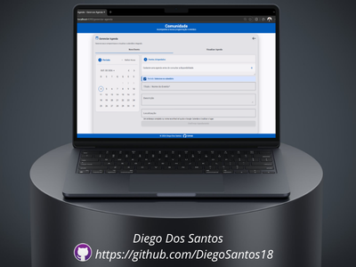
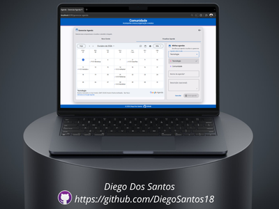
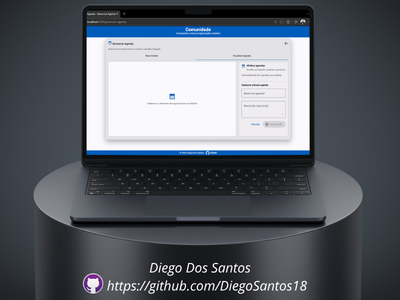
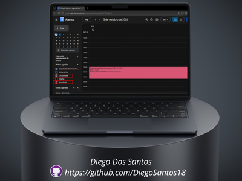
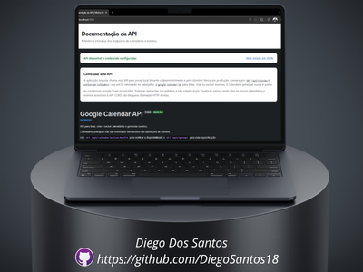
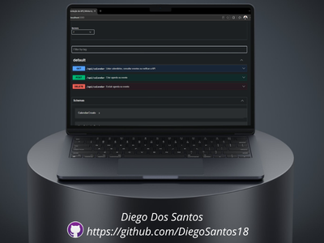

# 📅 Minha Agenda

Plataforma pessoal moderna e modular de gestão de compromissos e agenda, desenvolvida com **Angular (Standalone Components)** no frontend e um backend serverless leve em **Node.js/TypeScript**, integrada de forma segura com a **Google Calendar API** via OAuth2.

🌐 **Frontend Local:** `http://localhost:4200`
🌐 **API local (handler Vercel):** `http://localhost:3000`

### Estado e documentação da API

Com a API local em execução, abra `http://localhost:3000/` para ver a documentação interativa Swagger. O estado em JSON está em `http://localhost:3000/api/calendar?action=health`.

---

### Algumas Telas

<table>
  <tr>
    <td align="center" valign="top"><a href=".ideas/readme/upcoming-events-cards.png"></a><br><strong>Próximos Eventos — Cards</strong></td>
    <td align="center" valign="top"><a href=".ideas/readme/upcoming-events-empty.png"></a><br><strong>Próximos Eventos — Estado Vazio</strong></td>
  </tr>
  <tr>
    <td align="center" valign="top"><a href=".ideas/readme/manage-calendar-event-scheduled.png"></a><br><strong>Novo Evento — Eventos Agendados</strong></td>
    <td align="center" valign="top"><a href=".ideas/readme/manage-calendar-event-empty.png"></a><br><strong>Novo Evento — Sem Eventos Agendados</strong></td>
  </tr>
  <tr>
    <td align="center" valign="top"><a href=".ideas/readme/manage-calendar-view-calendars.png"></a><br><strong>Visualizar Agendas</strong></td>
    <td align="center" valign="top"><a href=".ideas/readme/manage-calendar-view-empty.png"></a><br><strong>Visualizar Agenda — Sem Agendas</strong></td>
  </tr>
  <tr>
    <td align="center" valign="top"><a href=".ideas/readme/google-calendar.png"></a><br><strong>Google Calendar Integrado</strong></td>
    <td align="center" valign="top"><a href=".ideas/readme/swagger-ui.png"></a><br><strong>Swagger UI</strong></td>
  </tr>
  <tr>
    <td align="center" valign="top"><a href=".ideas/readme/swagger-ui-vercel-endpoints.png"></a><br><strong>Swagger UI — Endpoints na Vercel</strong></td>
    <td></td>
  </tr>
</table>

---

Desenvolvido por **Diego Dos Santos**.

## 🛠️ Stack Tecnológica

### Frontend
* **Angular (Standalone Components)** com reatividade moderna baseada em **Signals** e **RxJS** (`timer`, `switchMap`).
* **SCSS** com design system limpo, responsivo e adaptado ao ecossistema Material 3.

### Backend / API (Serverless)
* **Vercel Serverless Functions** (`api/calendar.ts`) em Node.js & TypeScript.
* Biblioteca oficial `googleapis` para comunicação segura com o Google Calendar.

### Infraestrutura & Ferramentas
* **Vercel CLI** para gestão dos ambientes e deploy da API.
* **Git / GitHub** para versionamento e deploy automatizado.

---

## 🏗️ Arquitetura e Decisões Técnicas

### 1. Polling Inteligente
Sem a complexidade e o custo de servidores WebSocket persistentes, o projeto utiliza um polling otimizado no Angular (`timer` + `switchMap`) que sincroniza os eventos do calendário automaticamente em segundo plano.

### 2. CORS e acesso à API
Para suportar a arquitetura desacoplada (frontend no GitHub Pages e backend na Vercel), o servidor configura `Access-Control-Allow-Origin` usando `ALLOWED_ORIGIN`. CORS é uma política aplicada pelos navegadores: **não autentica usuários e não bloqueia clientes HTTP diretos**.

> **API pública, inclusive para escrita:** a API não exige autenticação. Qualquer pessoa que alcance os endpoints pode criar ou excluir agendas e eventos usando as credenciais Google guardadas no servidor. CORS não impede chamadas diretas. Não publique a API apontada para calendários com dados que não possam ser alterados ou apagados por terceiros.

### 3. Segurança de Credenciais
As chaves sensíveis da API do Google:
* `GOOGLE_CLIENT_SECRET`
* `GOOGLE_REFRESH_TOKEN`

**Nunca** são expostas no código do frontend. Elas residem exclusivamente no servidor e são geridas pelas **Variáveis de Ambiente da Vercel**.
`GOOGLE_CLIENT_ID` identifica o cliente OAuth usado pelo backend e pelo gerador do refresh token. Não há login de usuário no app nesta versão.

### 4. Autenticação OAuth2 Automatizada
O repositório conta com um script dedicado (`scripts/gerar-token.ts`) para gerar com segurança o token de acesso de longa duração (`refreshToken`) junto ao Google Cloud.

---

## 📂 Estrutura de Pastas e Ficheiros-Chave

```text
├── api/
│   └── calendar.ts           # Função serverless da Vercel (Backend Google Calendar)
├── scripts/
│   └── gerar-token.ts        # Script auxiliar para gerar o Refresh Token OAuth2
├── src/
│   ├── app/
│   │   ├── core/             # Modelos e serviços de calendário
│   │   ├── features/         # Agenda e gestão de eventos
│   │   └── shared/           # Componentes reutilizáveis
│   ├── environments/         # URLs da API por ambiente
│   └── styles.scss           # Estilos globais e tema Material
├── package.json
└── vercel.json
```

## 🚀 Configuração inicial

### Requisitos

* Node.js compatível com a versão instalada do Angular CLI.
* npm 11 (indicado pelo campo `packageManager`).
* Uma conta Google com acesso ao Google Calendar API.
* A Vercel CLI é necessária para operações de deploy/ambiente na Vercel; a API local usa o adaptador incluído no projeto.

Na raiz do repositório, instale as dependências:

```powershell
npm ci
```

Se ainda não existir um `.env` local, crie-o como cópia do exemplo:

```powershell
if (-not (Test-Path .env)) {
  Copy-Item .env.example .env
} else {
  Write-Host ".env já existe; preservando as configurações locais."
}
```

Depois, substitua os placeholders do `.env` pelos valores locais. Se o script `npm run auth:generate` não concluir o fluxo OAuth ou não gerar um refresh token, siga a alternativa **OAuth 2.0 Playground** abaixo. Não copie o `.env.example` por cima de um `.env` já existente: isso pode apagar credenciais ou configurações locais.

Não versione `.env` nem qualquer variante local `.env.*`: esses arquivos podem conter segredos OAuth. O `.gitignore` ignora esses arquivos e mantém `.env.example` versionado como modelo, com nomes de variáveis e valores de exemplo. Nesta versão, todas as operações do app são públicas e não há login de usuário.

### Onde configurar URLs e credenciais

| Arquivo/variável | Ambiente e finalidade | Versionar? |
|---|---|---|
| `src/environments/environment.development.ts` → `apiUrl: '/api'` | Angular local. O proxy de `npm start` encaminha chamadas para `http://localhost:3000`. | Sim; é configuração pública sem segredo. |
| `src/environments/environment.ts` | URL pública da API Vercel para o build Angular/GitHub Pages. | Sim; nunca colocar credenciais/tokens aqui. |
| `.env` → `API_URL_SEED=http://localhost:3000/api` | Scripts locais `seed:data` e `seed:delete`; aponta para a API que se deseja alterar. Para executar seeds contra produção, troque conscientemente pelo endpoint `/api` da Vercel. | Não; arquivo local ignorado. |
| Variáveis de ambiente da Vercel | `GOOGLE_CLIENT_ID`, `GOOGLE_CLIENT_SECRET`, `GOOGLE_REFRESH_TOKEN` e `ALLOWED_ORIGIN`. | Não versionar valores. Configure no painel/CLI da Vercel. |
| `.env.example` | Modelo sem segredos para saber quais variáveis os scripts locais precisam. | Sim. Revise e substitua qualquer valor real por placeholder antes de commitar. |

`API_URL_SEED` não é a URL que usa o frontend: ela só é lida pelos scripts de seed. Ela não precisa ser configurada na Vercel para publicar a API. A URL de produção do frontend é `apiUrl` em `environment.ts`; como o bundle Angular é público, o domínio Vercel não é segredo. Não colocar `GOOGLE_CLIENT_SECRET` ou refresh token nos environments Angular.

Os scripts `env:pull:dev`, `env:pull:preview` e `env:pull:prod` baixam variáveis da Vercel para `.env`. Use-os somente quando quiser atualizar a configuração local e nunca adicione o arquivo resultante ao Git. Depois de baixar variáveis de produção, confira `ALLOWED_ORIGIN` e `API_URL_SEED` antes de rodar localmente: para desenvolvimento, use `http://localhost:4200` e `http://localhost:3000/api`, respectivamente.

### Credenciais do Google Calendar

1. No Google Cloud Console, selecione ou crie um projeto e habilite **Google Calendar API**.
2. Configure a tela de consentimento OAuth e adicione sua conta como usuário de teste, se o app estiver em modo de teste.
3. Mantenha o cliente OAuth que emite o refresh token (`GOOGLE_CLIENT_ID` e `GOOGLE_CLIENT_SECRET`). O app não usa login de usuário nesta versão.
4. No cliente OAuth do tipo **Aplicativo da Web**, adicione `http://localhost:3001/oauth2callback` em **URIs de redirecionamento autorizadas**. O valor deve corresponder exatamente ao `OAUTH_REDIRECT_URI` do `.env`, incluindo protocolo, porta e caminho, sem barra final. A tela `redirect_uri_mismatch` significa que a URI enviada não está cadastrada nesse cliente OAuth.
5. Execute:

   ```powershell
   npm run auth:generate
   ```

6. Autorize o acesso no navegador. O script recebe o callback local na porta **3001** (a API continua na porta **3000**) e imprime o refresh token. Copie-o para `GOOGLE_REFRESH_TOKEN`.

Se usar outro redirect URI local, defina `OAUTH_REDIRECT_URI` no `.env` e cadastre exatamente o mesmo valor no Google Cloud Console. O endereço deve usar HTTP e `localhost`, `127.0.0.1` ou `::1`. O script imprime a URI que precisa estar cadastrada; se a porta estiver ocupada, encerra com instruções para liberá-la ou escolher outra porta.
Se não receber o callback dentro de `OAUTH_CALLBACK_TIMEOUT_MS` (5 minutos por padrão), o erro inclui a URI exata e os passos para resolver `redirect_uri_mismatch`. Isso evita aguardar sem orientação quando a página do Google rejeita a solicitação.

#### Alternativa: OAuth 2.0 Playground

Use esta alternativa somente se o fluxo local não concluir a autenticação. O Playground é uma ferramenta oficial do Google, mas o refresh token continua sendo um segredo e deve ser guardado apenas no `.env`/variáveis da Vercel.

1. No cliente OAuth do Google Cloud, adicione `https://developers.google.com/oauthplayground` às URIs de redirecionamento autorizadas.
2. Abra o [OAuth 2.0 Playground](https://developers.google.com/oauthplayground), selecione a engrenagem e habilite **Use your own OAuth credentials**.
3. Informe o mesmo `GOOGLE_CLIENT_ID` e `GOOGLE_CLIENT_SECRET` do `.env`.
4. Na etapa 1, informe o escopo `https://www.googleapis.com/auth/calendar`, autorize e conclua o consentimento com a conta que possui os calendários.
5. Na etapa 2, troque o código por tokens e copie o `refresh_token` da resposta para `GOOGLE_REFRESH_TOKEN`.
6. Reinicie a API local e confirme `status: "ok"` em `/api/calendar?action=health`; depois teste a listagem de calendários no app.

Se a resposta não trouxer `refresh_token`, revogue o acesso concedido ao cliente OAuth na conta Google e repita o consentimento com acesso offline. Nunca publique tokens, segredos ou a resposta completa do Playground.

### Variáveis de ambiente

| Variável | Uso |
|---|---|
| `GOOGLE_CLIENT_ID` | Identifica o cliente OAuth no backend e no gerador de token. |
| `GOOGLE_CLIENT_SECRET` | Segredo OAuth; somente API/scripts locais, nunca no Angular. |
| `GOOGLE_REFRESH_TOKEN` | Token de longa duração usado pela API para acessar o Calendar. |
| `ALLOWED_ORIGIN` | Origem autorizada por CORS, sem caminho. Local: `http://localhost:4200`; Vercel: `https://diegosantos18.github.io`. |
| `OAUTH_REDIRECT_URI` | Callback local do script `auth:generate`; padrão `http://localhost:3001/oauth2callback`. |
| `OAUTH_CALLBACK_TIMEOUT_MS` | Tempo máximo de espera pelo callback OAuth em milissegundos; padrão `300000` (5 minutos). |
| `API_URL_SEED` | Base da API para scripts de seed, por exemplo `http://localhost:3000/api`. |
| `CONFIRM_SEED_DELETE_CALENDAR_IDS` | Confirmação não interativa opcional para `seed:delete`; informe os IDs dos calendários seed em ordem alfabética, separados por vírgula. |

## 💻 Execução local

Execute os processos em terminais separados. O servidor Angular não usa a porta da API.

**Terminal 1 — handler da API Vercel em `http://localhost:3000`:**

```powershell
npm run api:dev
```

**Terminal 2 — Angular em `http://localhost:4200`:**

```powershell
npm start
```

`npm start` fixa `ng serve` na porta **4200** e encaminha `/api` para `localhost:3000`. O comando `api:dev` executa a mesma função serverless da Vercel por um adaptador Node local, sem iniciar a aplicação Angular na porta da API. Se a API já estiver respondendo na porta 3000, uma nova execução detecta e reutiliza a instância existente em vez de falhar com `EADDRINUSE`. Se outro serviço ocupar a porta, feche esse serviço antes de iniciar a API. Não execute o Angular com `--port 3000`.

Com a API iniciada, abra:

* Aplicação: `http://localhost:4200`
* Documentação Swagger e indicador de funcionamento: `http://localhost:3000/` (ou `http://localhost:3000/api/docs`)
* Especificação OpenAPI: `http://localhost:3000/api/openapi`
* Estado em JSON: `http://localhost:3000/api/calendar?action=health`

Na documentação Swagger, execute primeiro a listagem de calendários, copie um ID não principal e informe-o no campo `x-google-calendar-id` para as operações de eventos. A paginação aceita `skip` de `0` a `2499` e `take` de `1` a `2500`, com `skip + take` limitado a `2500`. Eventos com rótulos de cor modernos incluem também `eventColor` hexadecimal resolvida pelo backend; `colorId` continua disponível para eventos com a paleta legada. As operações de criação e exclusão não têm autenticação de usuário atualmente; CORS, o cabeçalho do calendário e a documentação Swagger não restringem clientes HTTP diretos.

O endpoint `health` retorna `status: "ok"` somente quando as três credenciais Google estão configuradas. A página de documentação abre mesmo antes dessa configuração e informa quando faltam credenciais.

### Erro `ERR_CONNECTION_REFUSED`

Esse erro significa que o frontend não alcançou o servidor da API. Inicie `npm run api:dev` no primeiro terminal, mantenha-o em execução e confirme que a documentação abre em `http://localhost:3000/`. Se a API já estiver no ar, o script informa que está reutilizando a instância. Iniciar apenas `npm start` não inicia a API.

## 🧭 Calendários e eventos

* A API e o seletor removem calendários marcados como principais. Não há fallback para `primary`.
* Na primeira execução (ou se o calendário salvo deixou de existir), o primeiro calendário não principal retornado pela Google Calendar API é selecionado e salvo no `localStorage`.
* A criação de uma agenda não exige um calendário selecionado. Na aba **Visualizar Agenda**, o painel ao lado do iframe permite trocar a agenda, cadastrar outra ou excluir a selecionada.
* A exclusão de uma agenda é permanente e remove também todos os eventos dela; a interface sempre pede confirmação. Listagem de eventos, criação e exclusão de eventos, assim como exclusão de agenda, exigem o ID de um calendário não principal no cabeçalho `x-google-calendar-id`.
* Criação e exclusão são públicas nesta versão e não exigem login. A confirmação de exclusão evita cliques acidentais, mas não protege a API de chamadas diretas.
* O seletor, a borda dos cards e o acento do cabeçalho usam `backgroundColor` do calendário. No cadastro, é possível escolher uma das 24 cores da paleta Google para agendas e uma das 11 cores para eventos; o evento pode herdar visualmente a cor da agenda. O fundo dos cards mistura a cor do evento (rótulos modernos e `colorId` legado) com a superfície Material.
* Se a lista não tiver calendários não principais, a aplicação não escolhe o principal automaticamente. Em **Gerenciar Agenda → Visualizar Agenda**, use **Cadastrar agenda** para criar uma; após o cadastro, ela é selecionada e exibida automaticamente.
* Datas são exibidas em `pt-BR` e horários usam sempre o padrão de 24 horas `HH:mm`; os campos aceitam horas de `00:00` a `23:59`.

## 🌱 Dados de demonstração

O seed cria (ou reutiliza, sem duplicar) dois calendários não principais — **Tecnologia** e **Comunidade** — com cores próprias. Os eventos estão separados por categoria em `scripts/seed/events-seed/events-seed.json`. As agendas são identificadas por marcadores na descrição, então não é necessário criar calendários nem preencher IDs manualmente. Configure `API_URL_SEED` no `.env` antes de executar contra local ou produção. Os eventos recebem uma propriedade privada para a reversão distinguir dados de demonstração de eventos reais.

```powershell
npm run seed:data
```

O comando cria apenas eventos seed ainda não encontrados e atualiza o `colorId` dos eventos seed existentes quando a cor configurada no JSON mudar. Eventos comuns nunca são atualizados por essa rotina. A API documenta essa operação restrita como `PATCH /api/calendar?action=update-seed-event`; ela valida os marcadores do evento e do calendário antes de alterar somente a cor. A reversão exclui somente eventos com o marcador privado nos calendários de demonstração; eventos sem marcador são preservados. Os calendários permanecem na conta após a reversão. Como a API lista eventos futuros, eventos seed antigos que já passaram não são retornados para exclusão automática. A exclusão exige confirmar os IDs completos dos calendários:

```powershell
npm run seed:delete
```

Para execução automatizada, defina `CONFIRM_SEED_DELETE_CALENDAR_IDS` com os IDs exibidos pelo comando, em ordem alfabética e separados por vírgula. Se houver falhas parciais, o script informa a contagem e termina com código de saída diferente de zero; eventos sem marcador (incluindo seeds antigos) devem ser removidos manualmente, após conferência.

## 🧪 Testes e build

```powershell
npm test -- --watch=false
npm run build
```

Para compilar continuamente durante o desenvolvimento:

```powershell
npm run watch
```

O build Angular é emitido em `dist/meu-site/browser`.

## ☁️ Deploy

### API na Vercel

1. Vincule o repositório a um projeto Vercel com a raiz do projeto na raiz do repositório.
2. Configure `GOOGLE_CLIENT_ID`, `GOOGLE_CLIENT_SECRET`, `GOOGLE_REFRESH_TOKEN` e `ALLOWED_ORIGIN` nas variáveis de ambiente da Vercel. Para este repositório, a origem do GitHub Pages é `https://diegosantos18.github.io` (sem o caminho `/angular-site-google-calendar/`).
3. Use `angular-site-google-calendar` como nome sugerido do projeto Vercel para obter `https://angular-site-google-calendar.vercel.app`. Faça deploy e teste `https://angular-site-google-calendar.vercel.app/`, `/api/openapi` e `/api/calendar?action=health`. Se a Vercel atribuir outro domínio, use esse domínio real nos passos seguintes.
4. Confira/versione `apiUrl` em `src/environments/environment.ts` como `https://angular-site-google-calendar.vercel.app/api` (ou o domínio efetivamente atribuído) antes de compilar a versão de produção. **Nunca publique `localhost:3000` no bundle do GitHub Pages.**

### Angular no GitHub Pages

Para um repositório de projeto chamado `angular-site-google-calendar`, o `base-href` deve incluir o nome do repositório:

```powershell
npm run build -- --configuration production --base-href=/angular-site-google-calendar/
```

Publique o conteúdo de `dist/meu-site/browser` no GitHub Pages (a origem configurada em **Settings → Pages** precisa apontar para o artefato/branch publicado). A configuração atual do repositório não inclui um workflow automático de publicação do Pages. Como o app usa rotas Angular sem `#`, configure também um fallback SPA no host para recarregar diretamente `/gerenciar-agenda`.

Depois do deploy, confirme que:

* `apiUrl` aponta para o domínio Vercel, não para `localhost`.
* `ALLOWED_ORIGIN` corresponde exatamente à origem pública do GitHub Pages.
* `health` informa `credentialsConfigured: true`.
* O seletor lista somente calendários não principais e seleciona o primeiro se ainda não houver uma escolha válida.
* O endpoint `.../api/calendar?action=health` indica `ok`.
